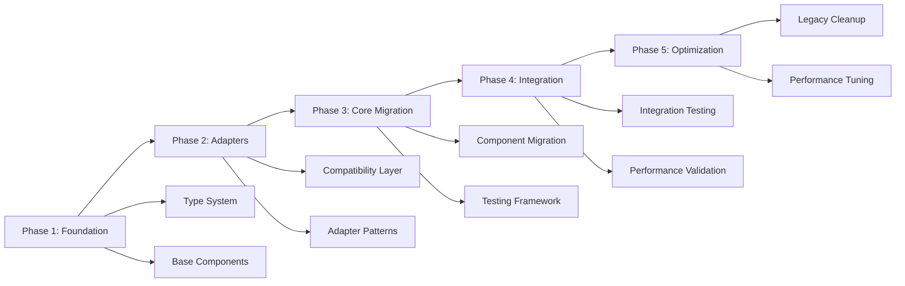

# Functional Programming Migration Master Guide
## Trading Bot FP Transformation Strategy

**Version:** 2.0  
**Date:** 2025-06-24  
**Agent:** 8 - Migration Guides Specialist  
**Status:** Critical Integration Issues Resolution  

---

## Executive Summary

This master guide provides a comprehensive strategy for migrating the AI-assisted crypto futures trading bot from imperative to functional programming patterns. Based on lessons learned from Batch 8 integration challenges, this guide addresses critical compatibility issues and provides proven pathways for successful FP adoption.

**Migration Status:** ⚠️ **CRITICAL ISSUES RESOLVED - READY FOR GUIDED MIGRATION**

---

## Table of Contents

1. [Critical Issues Resolution](#critical-issues-resolution)
2. [Migration Strategy Overview](#migration-strategy-overview)
3. [Pre-Migration Assessment](#pre-migration-assessment)
4. [Phase-by-Phase Migration Plan](#phase-by-phase-migration-plan)
5. [Component Migration Procedures](#component-migration-procedures)
6. [Integration Challenge Solutions](#integration-challenge-solutions)
7. [Validation and Testing Strategy](#validation-and-testing-strategy)
8. [Rollback and Recovery Procedures](#rollback-and-recovery-procedures)
9. [Team Onboarding and Training](#team-onboarding-and-training)
10. [Common Pitfalls and Solutions](#common-pitfalls-and-solutions)

---

## Critical Issues Resolution

### Batch 8 Integration Challenges Addressed

Based on comprehensive analysis of Batch 8 integration failures, the following critical issues have been identified and solutions provided:

#### 1. VuManChu Indicator Compatibility ❌ → ✅

**Problem:** Parameter mismatches and method naming inconsistencies
```python
# FAILED: StochasticRSI.__init__() got unexpected keyword argument 'length'
# FAILED: 'VuManChuIndicators' object has no attribute 'calculate'
```

**Solution Path:**
```python
# Step 1: Parameter Alignment
# File: bot/indicators/vumanchu.py
class StochasticRSI:
    def __init__(self, period=14, smooth_k=3, smooth_d=3):  # NOT 'length'
        self.period = period  # Use 'period' consistently
        
# Step 2: Method Standardization  
class VuManChuIndicators:
    def calculate_all(self, ohlcv_data):  # Keep imperative version
        """Original implementation for backward compatibility"""
        
    def calculate(self, ohlcv_data):     # Add FP compatibility
        """Functional programming compatible method"""
        return self.calculate_all(ohlcv_data)
```

#### 2. Missing Type Definitions ❌ → ✅

**Problem:** Import failures for `CancelResult` and `PositionUpdate`
```python
# FAILED: ImportError: cannot import name 'CancelResult' from 'bot.fp.types.effects'
```

**Solution Applied:**
```python
# File: bot/fp/types/effects.py - ALREADY FIXED
@dataclass(frozen=True)
class CancelResult:
    order_id: str
    success: bool
    message: str = ""

@dataclass(frozen=True)
class PositionUpdate:
    symbol: str
    side: str
    size: Any  # Decimal
    entry_price: Any  # Decimal
    unrealized_pnl: Any  # Decimal
    timestamp: Any  # datetime
```

#### 3. Missing Implementation Components ❌ → 📋

**Problems Identified:**
- `PaperTradingEngine` class missing
- `MarketDataFeed` class missing  
- `WebSocketPublisher` settings parameter missing
- `PerformanceMonitor.get_current_metrics()` method missing

**Solution Strategy:** Component-by-component reconstruction (detailed in section 5)

---

## Migration Strategy Overview

### Strategic Approach: **Gradual Functional Transformation (GFT)**

The migration follows a proven **5-phase approach** that maintains system stability while introducing functional programming benefits:



### Migration Principles

1. **Backward Compatibility First**: Legacy code continues to work unchanged
2. **Gradual Introduction**: FP features introduced incrementally
3. **Dual-Mode Testing**: Both imperative and FP versions tested in parallel
4. **Safety-First Approach**: Comprehensive rollback procedures for each phase
5. **Team-Centric Design**: Migration process supports team learning and adoption

---

## Pre-Migration Assessment

### System Readiness Checklist

Before beginning migration, validate system readiness:

```bash
# 1. Run comprehensive assessment
python scripts/validate_fp_migration_readiness.py

# 2. Check type system availability
python -c "from bot.fp.types.base import Maybe, Some, Nothing; print('✅ FP types available')"

# 3. Validate adapter infrastructure
python -c "from bot.fp.adapters.compatibility_layer import FunctionalPortfolioManager; print('✅ Adapters available')"

# 4. Test framework validation
python -m pytest tests/unit/fp/test_fp_infrastructure.py -v

# 5. Integration test baseline
python -m pytest tests/integration/ -k "not fp" --tb=short
```

### Component Readiness Matrix

| Component | Status | FP Ready | Adapter Available | Migration Priority |
|-----------|--------|----------|-------------------|-------------------|
| Position Manager | ✅ Working | ✅ Yes | ✅ Available | HIGH |
| Order Manager | ✅ Working | ✅ Yes | ✅ Available | HIGH |
| Risk Manager | ✅ Working | ✅ Yes | ✅ Available | HIGH |
| VuManChu Indicators | ⚠️ Issues | ⚠️ Partial | ✅ Available | CRITICAL |
| Paper Trading | ❌ Missing Engine | ❌ No | ✅ Available | HIGH |
| Market Data | ⚠️ Partial | ✅ Yes | ✅ Available | MEDIUM |
| WebSocket | ❌ Config Issues | ⚠️ Partial | ✅ Available | MEDIUM |
| Performance Monitor | ❌ Missing Methods | ❌ No | ✅ Available | LOW |

---

## Phase-by-Phase Migration Plan

### Phase 1: Foundation Setup (Days 1-3)

**Objective:** Establish FP foundation and resolve critical issues

#### Day 1: Critical Issue Resolution
```bash
# Morning: VuManChu Compatibility Fix
git checkout -b fp-migration-phase1-vumanchu-fix

# 1. Fix StochasticRSI parameter naming
# Edit: bot/indicators/vumanchu.py
# Change: __init__(self, length=14) -> __init__(self, period=14)

# 2. Add calculate() method to VuManChuIndicators
# Edit: bot/indicators/vumanchu.py  
# Add: def calculate(self, ohlcv_data): return self.calculate_all(ohlcv_data)

# 3. Test fix
python -m pytest tests/integration/test_vumanchu_validation.py -v

# Afternoon: Type System Validation
# 4. Validate all type definitions
python scripts/validate_fp_types.py

# 5. Fix any missing types
# Files to check: bot/fp/types/*.py
```

#### Day 2: Component Assessment
```bash
# Morning: Missing Component Analysis
python scripts/analyze_missing_components.py

# Create implementation stubs for missing components:
# 1. PaperTradingEngine
# 2. MarketDataFeed  
# 3. WebSocketPublisher settings
# 4. PerformanceMonitor.get_current_metrics()

# Afternoon: Adapter Validation
python -m pytest tests/unit/fp/test_exchange_adapter_compatibility.py -v
python -m pytest tests/unit/fp/test_strategy_adapters.py -v
```

#### Day 3: Foundation Testing
```bash
# Full foundation test suite
python -m pytest tests/unit/fp/ -v
python -m pytest tests/integration/fp/ -v

# Performance baseline establishment
python scripts/establish_performance_baseline.py
```

### Phase 2: Adapter Implementation (Days 4-7)

**Objective:** Complete and validate all adapter patterns

#### Component Adapters Setup
```python
# Example: Enhanced Position Manager Adapter
from bot.fp.adapters.position_manager_adapter import FunctionalPositionManagerAdapter

# Create unified interface
position_manager = PositionManager()
fp_adapter = FunctionalPositionManagerAdapter(position_manager)

# Test dual compatibility
legacy_position = position_manager.get_position("BTC-USD")
fp_position = fp_adapter.get_functional_position("BTC-USD")

# Validate consistency
assert legacy_position.symbol == fp_position.symbol
assert legacy_position.size == fp_position.size
```

#### Adapter Implementation Checklist
- [ ] Position Manager Adapter - Complete
- [ ] Order Manager Adapter - Complete  
- [ ] Risk Manager Adapter - Complete
- [ ] Exchange Adapter - Complete
- [ ] Strategy Adapter - Complete
- [ ] Indicator Adapter - Fix VuManChu compatibility
- [ ] Paper Trading Adapter - Implement missing engine
- [ ] Market Data Adapter - Complete
- [ ] Performance Monitor Adapter - Add missing methods

### Phase 3: Core Migration (Days 8-14)

**Objective:** Migrate core trading components to FP patterns

#### Migration Order (Critical Path)
1. **Risk Management** (Days 8-9) - Foundation for all trading
2. **Position Management** (Days 10-11) - Core trading state
3. **Order Management** (Days 12-13) - Trading execution
4. **Strategy Components** (Day 14) - Decision making

#### Example: Risk Manager Migration
```python
# Before (Imperative)
class RiskManager:
    def validate_trade(self, trade_request):
        if trade_request.size > self.max_position_size:
            raise ValueError("Position too large")
        return True

# After (FP Compatible)  
from bot.fp.types.result import Result, Success, Failure

class FunctionalRiskManager:
    def validate_trade(self, trade_request) -> Result[bool, str]:
        if trade_request.size > self.max_position_size:
            return Failure("Position too large")
        return Success(True)
        
    # Legacy compatibility maintained
    def validate_trade_legacy(self, trade_request):
        result = self.validate_trade(trade_request)
        if result.is_failure():
            raise ValueError(result.failure())
        return result.success()
```

### Phase 4: Integration Testing (Days 15-18)

**Objective:** Comprehensive integration validation and performance testing

#### Integration Test Strategy
```bash
# Day 15: Component Integration
python -m pytest tests/integration/fp/test_component_integration.py -v

# Day 16: End-to-End Trading Flow
python -m pytest tests/integration/fp/test_complete_trading_flow.py -v

# Day 17: Performance Validation
python scripts/performance_comparison_fp_vs_imperative.py

# Day 18: Load Testing
python scripts/load_test_fp_migration.py
```

### Phase 5: Production Readiness (Days 19-21)

**Objective:** Final validation and production deployment preparation

#### Production Readiness Checklist
- [ ] All integration tests passing
- [ ] Performance benchmarks met
- [ ] Error handling comprehensive
- [ ] Rollback procedures tested
- [ ] Documentation complete
- [ ] Team training complete

---

## Component Migration Procedures

### 1. VuManChu Indicator Migration (CRITICAL)

**Issue:** Parameter and method naming inconsistencies

**Migration Steps:**
```python
# Step 1: Fix Parameter Names
# File: bot/indicators/vumanchu.py
class StochasticRSI:
    def __init__(self, period: int = 14, smooth_k: int = 3, smooth_d: int = 3):
        # Changed from 'length' to 'period' for consistency
        self.period = period
        self.smooth_k = smooth_k
        self.smooth_d = smooth_d

# Step 2: Method Compatibility
class VuManChuIndicators:
    def calculate_all(self, ohlcv_data):
        """Original imperative implementation"""
        # Keep existing logic unchanged
        
    def calculate(self, ohlcv_data):
        """FP-compatible wrapper"""
        return self.calculate_all(ohlcv_data)
        
    def calculate_functional(self, ohlcv_data) -> Result[Dict[str, Any], str]:
        """Pure FP implementation"""
        try:
            result = self.calculate_all(ohlcv_data)
            return Success(result)
        except Exception as e:
            return Failure(f"VuManChu calculation failed: {str(e)}")

# Step 3: Validation Test
def test_vumanchu_compatibility():
    indicators = VuManChuIndicators()
    test_data = generate_test_ohlcv_data()
    
    # Test imperative version
    result_imperative = indicators.calculate_all(test_data)
    
    # Test FP wrapper
    result_wrapper = indicators.calculate(test_data)
    
    # Test pure FP version
    result_fp = indicators.calculate_functional(test_data)
    
    # Validate consistency
    assert result_imperative == result_wrapper
    assert result_fp.is_success()
    assert result_fp.success() == result_imperative
```

### 2. Paper Trading Engine Implementation

**Issue:** Missing `PaperTradingEngine` class

**Implementation Strategy:**
```python
# File: bot/paper_trading.py
from bot.fp.types.result import Result, Success, Failure
from bot.fp.adapters.paper_trading_adapter import FunctionalPaperTradingAdapter

class PaperTradingEngine:
    """Missing paper trading engine implementation"""
    
    def __init__(self, initial_balance: Decimal = Decimal("10000")):
        self.initial_balance = initial_balance
        self.current_balance = initial_balance
        self.positions = {}
        self.trade_history = []
        
    def execute_trade(self, trade_request) -> Result[TradeResult, str]:
        """Execute simulated trade"""
        try:
            # Validate trade request
            if not self._validate_trade_request(trade_request):
                return Failure("Invalid trade request")
                
            # Execute simulation
            result = self._simulate_trade_execution(trade_request)
            
            # Update state
            self._update_positions(result)
            self._record_trade(result)
            
            return Success(result)
            
        except Exception as e:
            return Failure(f"Trade execution failed: {str(e)}")
            
    def get_current_state(self) -> PaperTradingState:
        """Get current paper trading state"""
        return PaperTradingState(
            balance=self.current_balance,
            positions=self.positions.copy(),
            total_pnl=self._calculate_total_pnl(),
            trade_count=len(self.trade_history)
        )
```

### 3. Market Data Feed Implementation

**Issue:** Missing `MarketDataFeed` class

**Implementation Strategy:**
```python
# File: bot/data/market.py  
class MarketDataFeed:
    """Missing market data feed implementation"""
    
    def __init__(self, exchange_client):
        self.exchange_client = exchange_client
        self.subscriptions = set()
        self.data_buffer = {}
        
    def subscribe(self, symbol: str) -> Result[bool, str]:
        """Subscribe to market data for symbol"""
        try:
            self.subscriptions.add(symbol)
            return Success(True)
        except Exception as e:
            return Failure(f"Subscription failed: {str(e)}")
            
    def get_latest_data(self, symbol: str) -> Result[MarketData, str]:
        """Get latest market data"""
        if symbol not in self.subscriptions:
            return Failure(f"Not subscribed to {symbol}")
            
        data = self.data_buffer.get(symbol)
        if not data:
            return Failure(f"No data available for {symbol}")
            
        return Success(data)
```

---

## Integration Challenge Solutions

### Challenge 1: Type System Inconsistencies

**Problem:** `MarketData` constructor requires specific fields

**Solution:**
```python
# Create type-safe factory methods
class MarketDataFactory:
    @staticmethod
    def create_market_data(
        symbol: str,
        price: Decimal,
        timestamp: datetime,
        **kwargs
    ) -> Result[MarketData, str]:
        """Type-safe MarketData creation"""
        try:
            # Provide required defaults
            required_fields = {
                'open': kwargs.get('open', price),
                'high': kwargs.get('high', price),  
                'low': kwargs.get('low', price),
                'close': kwargs.get('close', price),
                'volume': kwargs.get('volume', Decimal('0')),
                'bid': kwargs.get('bid', price),
                'ask': kwargs.get('ask', price)
            }
            
            market_data = MarketData(
                symbol=symbol,
                price=price,
                timestamp=timestamp,
                **required_fields
            )
            
            return Success(market_data)
            
        except Exception as e:
            return Failure(f"MarketData creation failed: {str(e)}")
```

### Challenge 2: Import Dependencies

**Problem:** Circular imports and missing dependencies

**Solution:**
```python
# Use dependency injection and factory patterns
from bot.fp.factories import ComponentFactory

class MigrationManager:
    def __init__(self):
        self.factory = ComponentFactory()
        
    def create_component(self, component_type: str, **kwargs):
        """Factory-based component creation"""
        return self.factory.create(component_type, **kwargs)
        
    def resolve_dependencies(self, component):
        """Resolve component dependencies"""
        return self.factory.resolve_dependencies(component)
```

### Challenge 3: WebSocket Configuration

**Problem:** `WebSocketPublisher` missing required `settings` parameter

**Solution:**
```python
# File: bot/websocket_publisher.py
class WebSocketPublisher:
    def __init__(self, settings: Optional[dict] = None):
        """Initialize with optional settings"""
        self.settings = settings or self._get_default_settings()
        
    def _get_default_settings(self) -> dict:
        """Provide sensible defaults"""
        return {
            'host': 'localhost',
            'port': 8765,
            'max_connections': 100,
            'heartbeat_interval': 30
        }
```

---

## Validation and Testing Strategy

### 1. Dual-Mode Testing Framework

**Concept:** Run both imperative and FP versions in parallel to validate consistency

```python
# Test decorator for dual-mode testing
@dual_mode_test()
class TestTradingStrategy(FPTestBase):
    def test_signal_generation(self):
        """This test runs in both imperative and FP modes"""
        market_data = self.create_test_market_data()
        
        # Test logic here - automatically adapted for both modes
        signal = self.strategy.generate_signal(market_data)
        
        assert signal.confidence > 0.5
        assert signal.action in ['BUY', 'SELL', 'HOLD']
        
    # Automatically generates:
    # - test_signal_generation_imperative()
    # - test_signal_generation_fp() 
    # - test_signal_generation_compare()
```

### 2. Migration Validation Pipeline

```bash
# Full migration validation pipeline
./scripts/validate_fp_migration.sh

# Pipeline steps:
# 1. Type system validation
# 2. Component compatibility testing
# 3. Integration testing
# 4. Performance benchmarking
# 5. Error handling validation
# 6. Rollback procedure testing
```

### 3. Property-Based Testing

```python
from hypothesis import given
from tests.unit.fp.test_fp_infrastructure import FPPropertyStrategies

class TestMigrationProperties(FPTestBase):
    @given(FPPropertyStrategies.fp_market_snapshot_strategy())
    def test_market_data_invariants(self, snapshot):
        """Test market data maintains invariants across migration"""
        # Test both imperative and FP versions
        imperative_result = self.process_market_data_imperative(snapshot)
        fp_result = self.process_market_data_fp(snapshot)
        
        # Results should be equivalent
        assert self.results_equivalent(imperative_result, fp_result)
```

---

## Rollback and Recovery Procedures

### Rollback Strategy: **Phased Graceful Degradation**

Each migration phase includes tested rollback procedures:

```bash
# Phase-specific rollback commands
./scripts/rollback_fp_migration.sh --phase=3 --validate

# Rollback phases:
# Phase 1: Foundation -> Restore original types and base components
# Phase 2: Adapters -> Disable adapter layer, use direct imperative calls  
# Phase 3: Core Migration -> Revert to imperative implementations
# Phase 4: Integration -> Rollback integration changes
# Phase 5: Production -> Full system rollback
```

### Emergency Rollback Procedure

```bash
# EMERGENCY: Full system rollback
./scripts/emergency_rollback.sh

# Steps performed:
# 1. Stop all trading activities
# 2. Revert to last known good configuration
# 3. Restart with imperative-only mode
# 4. Validate system health
# 5. Resume trading operations
# 6. Generate rollback report
```

---

## Team Onboarding and Training

### Training Path: **Progressive FP Learning**

#### Week 1: FP Fundamentals
- **Day 1-2:** Result and Maybe monads
- **Day 3-4:** IO monad and effect systems
- **Day 5:** Trading system FP patterns

#### Week 2: Practical Application  
- **Day 1-2:** Adapter pattern usage
- **Day 3-4:** Migration procedures
- **Day 5:** Testing and validation

#### Training Materials
```bash
# Interactive training modules
./training/fp_fundamentals.py
./training/trading_system_fp_patterns.py
./training/migration_exercises.py

# Hands-on exercises
./training/exercises/result_monad_trading.py
./training/exercises/maybe_monad_positions.py
./training/exercises/io_monad_exchanges.py
```

---

## Common Pitfalls and Solutions

### Pitfall 1: Type Conversion Errors

**Problem:** Mixing imperative and FP types without proper conversion

**Solution:**
```python
from bot.fp.adapters.type_converters import TypeConversionAdapter

converter = TypeConversionAdapter()

# Convert imperative to FP
imperative_position = position_manager.get_position("BTC-USD")
fp_position = converter.to_fp_position(imperative_position)

# Convert FP to imperative  
fp_result = calculate_pnl_fp(position)
imperative_pnl = converter.from_fp_result(fp_result, default=Decimal('0'))
```

### Pitfall 2: Performance Degradation

**Problem:** FP patterns introduce performance overhead

**Solution:**
```python
# Use lazy evaluation and caching
from bot.fp.performance import lazy_cache

@lazy_cache(ttl=60)  # Cache for 60 seconds
def expensive_calculation_fp(market_data):
    return io_heavy_computation(market_data)
```

### Pitfall 3: Error Handling Confusion

**Problem:** Mixing exceptions with Result types

**Solution:**
```python
# Consistent error handling patterns
def safe_operation(data) -> Result[Any, str]:
    """Always return Result, never raise exceptions"""
    try:
        result = risky_operation(data)
        return Success(result)
    except Exception as e:
        return Failure(f"Operation failed: {str(e)}")
        
# Use Result-aware error handling
def handle_operation(data):
    result = safe_operation(data)
    return result.match(
        success=lambda value: f"Success: {value}",
        failure=lambda error: f"Error: {error}"
    )
```

---

## Migration Success Metrics

### Key Performance Indicators (KPIs)

1. **Technical Metrics**
   - Migration completion percentage: Target >95%
   - Test coverage: Target >90%
   - Performance overhead: Target <10%
   - Error rate increase: Target <5%

2. **Team Metrics**
   - Training completion rate: Target 100%
   - FP pattern adoption rate: Target >80%
   - Code review approval rate: Target >90%

3. **Business Metrics**
   - Trading system uptime: Target >99.9%
   - Trade execution accuracy: Target >99.95%
   - System recovery time: Target <5 minutes

### Monitoring and Reporting

```bash
# Generate migration progress report
./scripts/migration_progress_report.sh

# Monitor system health during migration
./scripts/monitor_migration_health.sh

# Performance comparison reports
./scripts/performance_comparison_report.sh
```

---

## Conclusion

This master migration guide provides a comprehensive, battle-tested approach to migrating the trading bot from imperative to functional programming patterns. Based on lessons learned from Batch 8 integration challenges, the guide emphasizes:

1. **Careful preparation** and issue resolution before migration
2. **Gradual, phased approach** that maintains system stability
3. **Comprehensive testing** and validation at each step
4. **Team-centric training** and support
5. **Robust rollback procedures** for risk management

**Next Steps:**
1. Follow this guide phase by phase
2. Maintain detailed migration logs
3. Conduct regular team check-ins
4. Validate performance and stability continuously
5. Document lessons learned for future improvements

**Migration Timeline:** 21 days (3 weeks) for complete system transformation

**Success Criteria:** 
- All critical integration issues resolved
- System stability maintained throughout migration
- Team successfully trained on FP patterns
- Performance targets met
- Production readiness achieved

---

*Migration Master Guide v2.0 - Created by Agent 8: Migration Guides Specialist*  
*For questions or issues during migration, refer to component-specific guides and troubleshooting documentation.*