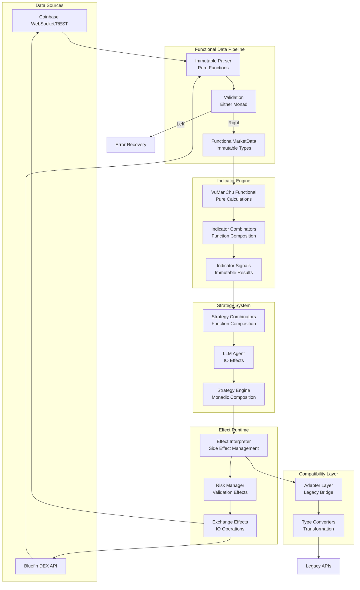
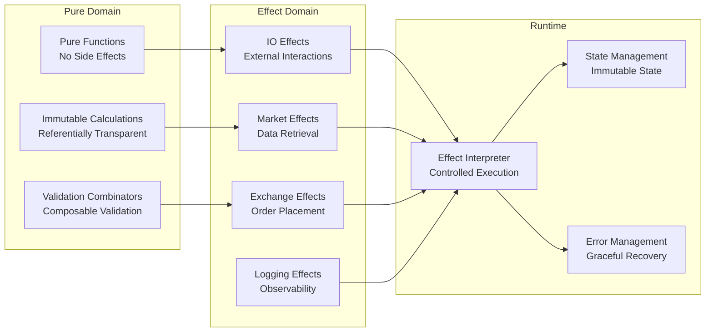
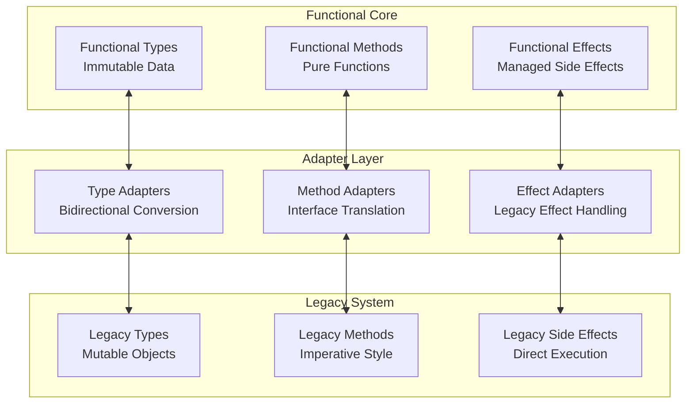

# AI Trading Bot – Functional Programming Architecture Guide

*Version: 2.0 / 2025-06-24 - Functional Programming Transformation*

## 1. Objective

Build an AI-assisted crypto-futures trading bot with functional programming architecture supporting both Coinbase and Bluefin exchanges. Primary decision-making is handled by a **LangChain agent** powered by large language models (LLMs). The system now employs immutable data structures, monadic error handling, and purely functional programming patterns while maintaining full backward compatibility with imperative code.

Custom technical indicators (VuManChu Cipher A & B) are re-implemented in both functional and imperative Python versions for maximum local control and flexibility.

## 2. Functional Programming Architecture Overview

### Core Functional Programming Components

| Component | Purpose | Implementation Location | Status |
|-----------|---------|-------------------------|--------|
| **Either Monad** | Error handling without exceptions | [`bot/fp/core/either.py`] | ✅ Working |
| **IO Monad** | Side effect management | [`bot/fp/effects/io.py`] | ✅ Working |
| **Effect System** | Composable side effects | [`bot/fp/effects/`] | ✅ Working |
| **Runtime Interpreter** | Effect execution engine | [`bot/fp/runtime/interpreter.py`] | ✅ Working |
| **Immutable Types** | Type-safe data structures | [`bot/fp/types/`] | ✅ Working |
| **Strategy Combinators** | Functional strategy composition | [`bot/fp/strategies/base.py`] | ✅ Working |
| **Adapter Layer** | Legacy compatibility bridge | [`bot/fp/adapters/`] | ⚠️ Partial |

### High-Level Functional Data Flow

| Layer | Responsibility | Functional Implementation | Legacy Compatibility |
|-------|----------------|---------------------------|---------------------|
| **Data Pipeline** | Immutable market data processing | [`bot/fp/data_pipeline.py`] | ✅ Compatible |
| **Functional Indicators** | Pure VuManChu Cipher computation | [`bot/fp/indicators/vumanchu_functional.py`] | ⚠️ Integration Issues |
| **Strategy Engine** | Monadic strategy composition | [`bot/fp/strategies/`] | ✅ Compatible |
| **Effect Runtime** | IO effect interpretation | [`bot/fp/runtime/`] | ✅ Working |
| **Adapter Layer** | Imperative/functional bridge | [`bot/fp/adapters/`] | ⚠️ Partial |
| **Exchange Layer** | Multi-exchange support (Coinbase/Bluefin) | [`bot/exchange/`] | ✅ Compatible |

## 3. Tech Stack

### Core Technologies
* **Python 3.12** with advanced type hints and functional programming features
* **Poetry** for dependency and virtual environment management
* **Pydantic v2** for immutable data models with validation
* **Pandas/NumPy** with functional programming patterns for technical analysis

### Functional Programming Stack
* **Custom Monad Implementation** (Either, Maybe, IO)
* **Effect System** for side effect management
* **Immutable Data Structures** with validation
* **Functional Composition** utilities and combinators
* **Type-Safe Configuration** with compile-time validation

### Exchange Integration
* **Multi-Exchange Support** (Coinbase Advanced API, Bluefin DEX on Sui)
* `coinbase-advanced-py` SDK for centralized exchange
* Custom Bluefin client for decentralized exchange on Sui blockchain
* Unified exchange interface with adapter pattern

### AI and Strategy Engine
* **LangChain** for LLM integration with structured output
* **OpenAI API** for trading decision making
* **Memory-Enhanced Agent** with MCP integration for learning
* **Functional Strategy Combinators** for strategy composition

### Development and Quality Assurance
* **Testing**: `pytest` with functional property-based testing
* **Code Quality**: `black`, `ruff`, `mypy` with strict type checking
* **Security**: `bandit` for vulnerability scanning
* **Pre-commit Hooks** for automated quality checks

## 4. Functional Programming Directory Structure

```text
bot/
├── __init__.py
├── main.py                    # CLI orchestration
├── config.py                  # Configuration with FP types
│
├── fp/                        # Functional Programming Core
│   ├── core/                  # Fundamental FP abstractions
│   │   ├── either.py          # Either monad for error handling
│   │   ├── option.py          # Maybe/Option monad
│   │   ├── io.py              # IO monad for side effects
│   │   └── validation.py      # Validation combinators
│   │
│   ├── types/                 # Immutable type system
│   │   ├── base.py            # Money, Percentage, Symbol, TimeInterval
│   │   ├── market.py          # Market data types
│   │   ├── trading.py         # Trading signal types
│   │   ├── portfolio.py       # Portfolio and position types
│   │   ├── risk.py            # Risk management types
│   │   ├── indicators.py      # Indicator result types
│   │   └── effects.py         # Effect type definitions
│   │
│   ├── effects/               # Side effect management
│   │   ├── io.py              # IO and async effects
│   │   ├── market_data.py     # Market data effects
│   │   ├── exchange.py        # Exchange operation effects
│   │   ├── logging.py         # Functional logging effects
│   │   ├── config.py          # Configuration effects
│   │   └── monitoring.py      # Performance monitoring effects
│   │
│   ├── runtime/               # Effect execution engine
│   │   ├── interpreter.py     # Main effect interpreter
│   │   ├── state.py           # State management
│   │   ├── scheduler.py       # Task scheduling
│   │   └── monitoring.py      # Runtime monitoring
│   │
│   ├── strategies/            # Functional strategy system
│   │   ├── base.py            # Strategy types and combinators
│   │   ├── execution.py       # Strategy execution engine
│   │   ├── llm_functional.py  # Functional LLM integration
│   │   ├── risk_management.py # Functional risk strategies
│   │   └── market_making.py   # Market making strategies
│   │
│   ├── indicators/            # Pure functional indicators
│   │   ├── vumanchu_functional.py  # Functional VuManChu implementation
│   │   ├── combinators.py     # Indicator composition utilities
│   │   ├── moving_averages.py # MA calculations
│   │   ├── oscillators.py     # RSI, Stochastic, etc.
│   │   └── patterns.py        # Pattern recognition
│   │
│   └── adapters/              # Legacy compatibility layer
│       ├── compatibility_layer.py    # Main compatibility interface
│       ├── exchange_adapter.py       # Exchange compatibility
│       ├── strategy_adapter.py       # Strategy compatibility
│       ├── indicator_adapter.py      # Indicator compatibility
│       └── type_converters.py        # Type conversion utilities
│
├── data/                      # Market data (legacy + enhanced)
│   ├── market.py              # Enhanced market data integration
│   └── bluefin_market.py      # Bluefin-specific data handling
│
├── indicators/                # Legacy indicators (preserved)
│   ├── vumanchu.py            # Original imperative implementation
│   └── [other indicators...]  # Additional technical indicators
│
├── strategy/                  # Strategy engine (legacy + enhanced)
│   ├── llm_agent.py           # Enhanced LLM agent
│   ├── memory_enhanced_agent.py    # Memory-enhanced trading agent
│   └── core.py                # Fallback strategies
│
├── exchange/                  # Multi-exchange support
│   ├── base.py                # Abstract exchange interface
│   ├── coinbase.py            # Coinbase Advanced API
│   ├── bluefin.py             # Bluefin DEX integration
│   └── factory.py             # Exchange factory pattern
│
├── risk/                      # Risk management
│   └── risk_manager.py        # Enhanced risk management
│
├── backtest/                  # Backtesting engine
│   └── engine.py              # Enhanced backtesting with FP types
│
└── validation/                # Enhanced validation
    └── pipeline.py            # Validation pipeline with FP types

tests/
├── unit/fp/                   # Functional programming unit tests
├── integration/fp/            # FP integration tests
├── property/                  # Property-based testing
└── [legacy test structure]    # Existing test preservation

docs/
├── AI_Trading_Bot_Architecture.md       # This document
├── vumanchu_cipher_reference.md          # VuManChu implementation reference
├── FP_MIGRATION_GUIDE.md                 # Functional programming migration guide
└── INTEGRATION_TROUBLESHOOTING.md        # Integration issue resolution
```

## 5. Functional Programming Data Flow

### Immutable Data Pipeline



### Effect Composition Flow



### Legacy Compatibility Bridge



## 6. Indicator Implementation (`bot/indicators/vumanchu.py`)

* **Cipher A**
  * EMA cloud trend dots
  * RSI divergence detection
  * Trend confirmation filters
* **Cipher B**
  * VWAP-driven money-flow index
  * Zero-lag MACD style “waves”
  * Positive/negative momentum cross detection

Guidelines:
* Use **vectorized** `numpy`/`pandas` operations; no for-loops.
* Return latest state plus full series for backtests.
* Provide typings:
  ```python
  def cipher_a(df: pd.DataFrame) -> pd.Series: ...
  def cipher_b(df: pd.DataFrame) -> pd.DataFrame:  # cols: wave, money_flow, etc.
  ```

* For the full Pine-Script reference, see [docs/vumanchu_cipher_reference.md].
## 7. Functional Programming System Components

### 7.1 Core Monad Implementation

**Either Monad (`bot/fp/core/either.py`)**
```python
class Either[E, T]:
    """Functional error handling without exceptions"""
    
    def map(self, func: Callable[[T], U]) -> Either[E, U]: ...
    def flat_map(self, func: Callable[[T], Either[E, U]]) -> Either[E, U]: ...
    def fold(self, left_func: Callable[[E], U], right_func: Callable[[T], U]) -> U: ...

# Usage example
result = try_either(lambda: risky_calculation())
final_result = result.map(apply_transformation).fold(
    handle_error,
    process_success
)
```

**IO Monad (`bot/fp/effects/io.py`)**
```python
class IO[A]:
    """Lazy evaluation of side effects"""
    
    def map(self, f: Callable[[A], B]) -> IO[B]: ...
    def flat_map(self, f: Callable[[A], IO[B]]) -> IO[B]: ...
    def run(self) -> A: ...  # Execute the computation

# Usage example
market_data_effect = IO.from_callable(lambda: fetch_market_data())
processed_data = market_data_effect.map(calculate_indicators)
result = processed_data.run()  # Execute all side effects
```

**Effect Interpreter (`bot/fp/runtime/interpreter.py`)**
```python
class EffectInterpreter:
    """Central effect execution engine"""
    
    def run_effect(self, effect: IO[A]) -> A: ...
    def run_async_effect(self, effect: AsyncIO[A]) -> A: ...
    def run_either_effect(self, effect: IOEither[Exception, A]) -> A: ...
```

### 7.2 Immutable Type System

**Base Types (`bot/fp/types/base.py`)**
```python
@dataclass(frozen=True)
class Money:
    amount: Decimal
    currency: str
    
    @classmethod
    def create(cls, amount: float, currency: str) -> Result[Money, str]: ...

@dataclass(frozen=True)
class Symbol:
    value: str
    
    @property
    def base(self) -> str: ...  # BTC from BTC-USD
    @property
    def quote(self) -> str: ... # USD from BTC-USD
```

**Trading Types (`bot/fp/types/trading.py`)**
```python
@dataclass(frozen=True) 
class TradeSignal:
    signal: SignalType  # LONG, SHORT, HOLD
    strength: float
    confidence: float
    reason: str
    metadata: dict[str, Any]

@dataclass(frozen=True)
class PositionSnapshot:
    positions: list[FunctionalPosition]
    total_value: Money
    unrealized_pnl: Money
    timestamp: datetime
```

### 7.3 Strategy Combinators

**Function Composition (`bot/fp/strategies/base.py`)**
```python
# Strategy is a function: MarketSnapshot -> TradeSignal
Strategy = Callable[[MarketSnapshot], TradeSignal]

def combine_strategies(
    strategies: list[tuple[str, Strategy, float]], 
    aggregation: str = "weighted_average"
) -> Strategy: ...

def filter_strategy(
    strategy: Strategy, 
    condition: Callable[[MarketSnapshot], bool]
) -> Strategy: ...

def threshold_strategy(strategy: Strategy, min_strength: float = 0.7) -> Strategy: ...

# Usage example
momentum_strategy = create_momentum_strategy(lookback=20)
mean_reversion_strategy = create_mean_reversion_strategy(lookback=20)

combined = combine_strategies([
    ("momentum", momentum_strategy, 0.6),
    ("mean_reversion", mean_reversion_strategy, 0.4)
])

filtered = filter_strategy(combined, lambda s: s.volume > 1000000)
final_strategy = threshold_strategy(filtered, min_strength=0.8)
```

### 7.4 Effect System Architecture

**Side Effect Management**
```python
# Market data effects
def fetch_market_data(symbol: Symbol) -> IO[MarketData]: ...
def subscribe_to_stream(symbol: Symbol) -> AsyncIO[Observable[MarketData]]: ...

# Exchange effects  
def place_order(order: OrderRequest) -> IOEither[OrderError, OrderResult]: ...
def cancel_order(order_id: str) -> IOEither[CancelError, CancelResult]: ...

# Logging effects
def log_info(message: str, context: dict) -> IO[None]: ...
def log_error(message: str, error: Exception) -> IO[None]: ...

# Effect composition
trading_pipeline = (
    fetch_market_data(symbol)
    .flat_map(lambda data: calculate_indicators(data))
    .flat_map(lambda signals: execute_strategy(signals))
    .flat_map(lambda decision: place_order_if_needed(decision))
)

result = run_effect(trading_pipeline)
```

## 8. Enhanced LangChain Decision Engine (`bot/strategy/llm_agent.py`)

### 8.1 Enhanced Functional Prompt Template

```text
You are an expert crypto futures trader.
Respond ONLY in JSON matching this schema:
{
  "action": "LONG|SHORT|CLOSE|HOLD",
  "size_pct": 0-100,
  "take_profit_pct": number,
  "stop_loss_pct": number,
  "rationale": string
}
Inputs:
- market: {symbol} {interval}
- ohlcv_tail: {csv block}        # last N candles (configurable)
- cipherA_dot: {value}
- cipherB_wave: {value}
- current_position: {flat|long|short}
Constraints:
- size_pct <= MAX_SIZE_PCT ({cfg.max_size_pct})
- leverage fixed at {cfg.leverage}x
```

### 7.2 Chain Construction
```python
from langchain.chat_models import ChatOpenAI
from langchain.schema.output_parser import JsonOutputParser

model = ChatOpenAI(model="gpt-4o", temperature=0.1)
template = PromptTemplate.from_file("prompts/trade_action.txt")
chain = (template | model | JsonOutputParser(pydantic_model=TradeAction))
```

### 7.3 TradeAction Data Model
```python
class TradeAction(BaseModel):
    action: Literal["LONG", "SHORT", "CLOSE", "HOLD"]
    size_pct: conint(ge=0, le=100)
    take_profit_pct: confloat(gt=0)
    stop_loss_pct: confloat(gt=0)
    rationale: constr(max_length=120)
```

## 8. Validation & Risk (`bot/validator.py`, `bot/risk.py`)

* Validate LLM JSON output with pydantic; on error → `HOLD`.
* Enforce:
  * `size_pct` ≤ account free margin & config cap
  * Daily drawdown, max concurrent trades, etc.
* Inject TP/SL levels into order before sending.

## 9. Trading Layer (`bot/exchange/coinbase.py`)

* Thin wrapper over `coinbase-advanced-py`:
  * `place_market_order`, `place_limit_order`, `cancel_all`, etc.
* Handle auth via env vars (`CB_API_KEY`, `CB_API_SECRET`).
* Convert `%`-based TP/SL to absolute price.

## 10. Configuration (`bot/config.py`)

```python
class Settings(BaseSettings, env_file=".env", frozen=True):
    symbol: str = "BTC-USD"
    interval: str = "1m"
    leverage: int = 5
    max_size_pct: int = 20      # max 20 % of equity
    model_provider: Literal["openai", "ollama"] = "openai"
    openai_api_key: str | None = None
    # …
```

## 11. CLI Entry (`bot/main.py`)

* `python -m bot.main live` – starts real-time loop
* `python -m bot.main backtest --from 2024-01-01 --to 2025-01-01`
* Graceful SIGINT shutdown; pending order cancels.

## 12. Testing

* **Unit tests** per module (`tests/`): indicators, validator, risk.
* **Golden prompt tests**: record LLM calls with LangChain “vcr” to avoid hitting API every run.
* **Backtest** coverage ≥1 year on BTC & ETH.

## 13. Development Workflow

1. `poetry install`
2. Copy `.env.example` → `.env`, add keys.
3. Run `pre-commit install`.
4. Implement indicator math first (passes unit tests).
5. Build LLM agent, test prompt locally via `python scripts/try_prompt.py`.
6. Integrate exchange layer with dry-run flag.
7. Confirm end-to-end in backtest before live.

## 14. Integration Challenges and Known Issues

### 14.1 Current Integration Status

| Component | Status | Issues | Priority |
|-----------|--------|--------|----------|
| **FP Core Components** | ✅ Working | None | - |
| **VuManChu Implementation** | ⚠️ Partial | Parameter mismatches | Critical |
| **Adapter Layer** | ⚠️ Partial | Type conversion gaps | High |
| **Enhanced Data Layer** | ⚠️ Partial | Missing components | High |
| **Paper Trading** | ❌ Broken | Missing engine | High |
| **WebSocket Integration** | ❌ Broken | Configuration issues | Medium |

### 14.2 Critical Issues Requiring Resolution

**VuManChu Implementation Compatibility (CRITICAL)**
```
Issue: StochasticRSI.__init__() parameter mismatch
- Functional implementation expects different parameter names
- Method naming inconsistency: calculate() vs calculate_all()
- API incompatibility between implementations

Impact: Breaks trading strategy functionality
Resolution: Align parameter names and method signatures
```

**Missing Type Definitions (HIGH)**
```
Issue: Import failures in FP effects system
- Missing CancelResult and PositionUpdate types
- MarketData constructor parameter mismatches
- Type conversion gaps in adapter layer

Impact: Runtime errors and integration test failures
Resolution: Complete type definitions and adapter implementations
```

**Missing Implementation Components (HIGH)**
```
Issues:
- PaperTradingEngine class not found in bot.paper_trading
- MarketDataFeed class not found in bot.data.market  
- WebSocketPublisher missing required settings parameter
- PerformanceMonitor.get_current_metrics() method missing

Impact: Real-time processing and simulation capabilities compromised
Resolution: Implement missing components or fix imports
```

### 14.3 Troubleshooting Guide

**VuManChu Parameter Alignment**
```python
# Fix StochasticRSI parameter names
# OLD (functional):
stoch = StochasticRSI(length=14, rsi_length=14, k_smooth=3, d_smooth=3)

# NEW (aligned):
stoch = StochasticRSI(period=14, rsi_period=14, k_period=3, d_period=3)

# Method naming standardization
# Use 'calculate' consistently across all implementations
result = indicator.calculate(data)  # Not calculate_all()
```

**Type System Fixes**
```python
# Ensure MarketData constructor compatibility
market_data = MarketData(
    symbol=symbol,
    timestamp=timestamp,
    open=open_price,    # Required field
    high=high_price,    # Required field
    low=low_price,      # Required field
    close=close_price,  # Required field
    volume=volume
)

# Fix missing effect types
@dataclass(frozen=True)
class CancelResult:
    order_id: str
    success: bool
    message: str = ""

@dataclass(frozen=True) 
class PositionUpdate:
    symbol: str
    side: str
    size: Decimal
    entry_price: Decimal
    unrealized_pnl: Decimal
    timestamp: datetime
```

**Adapter Layer Debugging**
```python
# Enable adapter debugging
adapter = VuManchuAdapter(debug=True)
result = adapter.get_functional_result(data)

# Validate consistency between implementations
consistency = adapter.validate_consistency(data)
if not consistency["overall_consistent"]:
    logger.warning("Adapter inconsistency: %s", consistency)
```

### 14.4 Migration Strategy

**Phase 1: Critical Fixes (1-2 days)**
1. Fix VuManChu parameter compatibility
2. Complete missing type definitions
3. Resolve import dependencies

**Phase 2: Component Completion (3-5 days)**
1. Implement missing paper trading engine
2. Complete adapter layer implementations
3. Fix WebSocket integration issues

**Phase 3: Validation and Testing (1-2 days)**
1. Re-run all integration tests
2. Validate end-to-end trading flow
3. Performance benchmarking

### 14.5 Testing Strategy

**Property-Based Testing for FP Components**
```python
from hypothesis import given, strategies as st

@given(st.lists(st.floats(min_value=0.01, max_value=1000.0), min_size=50))
def test_vumanchu_functional_properties(prices):
    """Test VuManChu functional implementation properties"""
    ohlcv = create_ohlcv_from_prices(prices)
    result = vumanchu_cipher(ohlcv)
    
    # Property: Results should be deterministic
    result2 = vumanchu_cipher(ohlcv)
    assert result == result2
    
    # Property: Wave values should be bounded
    assert -200 <= result.wave_a <= 200
    assert -200 <= result.wave_b <= 200
```

**Integration Test Coverage**
```python
def test_functional_imperative_consistency():
    """Ensure functional and imperative implementations agree"""
    data = load_test_market_data()
    
    # Get results from both implementations
    functional_result = vumanchu_functional.vumanchu_cipher(data)
    imperative_result = vumanchu_imperative.calculate_all(data)
    
    # Validate consistency within tolerance
    assert abs(functional_result.wave_a - imperative_result['wave_a']) < 0.001
    assert abs(functional_result.wave_b - imperative_result['wave_b']) < 0.001
```

## 15. Future Enhancements

### Functional Programming Roadmap
* **Advanced Monadic Patterns**: State monad for complex state management
* **Streaming Data Processing**: Functional reactive programming for real-time data
* **Distributed Computing**: Effect system for multi-node processing
* **Machine Learning Integration**: Functional ML pipelines with immutable datasets

### Traditional Enhancements
* Integrate RAG book knowledge via [`bot/train/reader.py`]
* Add Slack/Discord alerting module
* Multi-symbol support & portfolio optimizer
* Reinforcement-learning fine-tuning of prompt & risk params

---

## VuManChu Cipher A & B Documentation

**Complete Pine Script Reference Preserved**: All original VuManChu Cipher A and Cipher B implementations, parameters, and mathematical formulas are documented in [`docs/vumanchu_cipher_reference.md`]. This reference contains the complete Pine Script source code that serves as the ground truth for both functional and imperative Python implementations.

**Dual Implementation Strategy**: The system maintains both functional and imperative VuManChu implementations to ensure:
- **Functional Purity**: Pure mathematical calculations without side effects
- **Legacy Compatibility**: Existing APIs and interfaces preserved
- **Accuracy Validation**: Cross-validation between implementations
- **Performance Optimization**: Both approaches available for different use cases

---

*Updated by: Agent 1 - Architecture Documentation Specialist (Batch 9)*  
*Original Author: Architect Roo*  
*Functional Programming Transformation: 2025-06-24*  
*Original Architecture: 2025-06-11*
