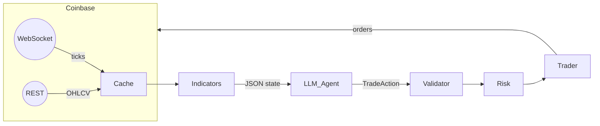

# AI Trading Bot – Architecture & Implementation Guide

*Version: 0.1 / 2025-06-11*

## 1. Objective

Build an AI-assisted crypto-futures trading bot for Coinbase Futures.
Primary decision-making is handled by a **LangChain agent** powered by large language models (LLMs).
Custom technical indicators (VuManChu Cipher A & B) are re-implemented in Python for full local control.

## 2. High-Level Components

| Layer | Responsibility | Key Files |
|-------|----------------|-----------|
| **Data Feed** | Ingest real-time OHLCV + tick data from Coinbase REST & WebSocket | [`bot/data/market.py`] |
| **Indicators** | Compute Cipher A & B plus utility indicators (EMA, RSI, VWAP, MFI, etc.) | [`bot/indicators/vumanchu.py`] |
| **LLM Agent** | Assemble market state → prompt → JSON action | [`bot/strategy/llm_agent.py`] |
| **Validator** | Enforce JSON schema, default to `HOLD` on invalid | [`bot/validator.py`] |
| **Risk Manager** | Position sizing, leverage, TP/SL, daily loss guard | [`bot/risk.py`] |
| **Trader** | Translate `TradeAction` to Coinbase REST order calls | [`bot/exchange/coinbase.py`] |
| **Scheduler / CLI** | Orchestrates loop; CLI flags for dry-run, backtest | [`bot/main.py`] |

## 3. Tech Stack

* Python 3.12 (type hints, `slots`)
* **Poetry** for dependency/venv management
* `coinbase-advanced-py` SDK
* `pandas`, `numpy`, `pandas-ta` for TA math
* `langchain` + chosen LLM connector (`openai`, `ollama`, etc.)
* `pydantic` v2 for data models & settings
* `python-dotenv` for secret management
* Tooling: `pytest`, `black`, `ruff`, `pre-commit`

## 4. Directory Layout

```text
bot/
├── __init__.py
├── main.py
├── config.py
├── data/
│   └── market.py
├── indicators/
│   └── vumanchu.py
├── strategy/
│   ├── __init__.py
│   ├── llm_agent.py
│   └── core.py        # fallback rule logic, optional
├── exchange/
│   └── coinbase.py
├── risk.py
├── validator.py
├── backtest/
│   └── engine.py
└── train/
    └── reader.py      # future RAG integration
tests/
docs/
```

## 5. Data Flow



## 6. Indicator Implementation (`bot/indicators/vumanchu.py`)

* **Cipher A**
  * EMA cloud trend dots
  * RSI divergence detection
  * Trend confirmation filters
* **Cipher B**
  * VWAP-driven money-flow index
  * Zero-lag MACD style “waves”
  * Positive/negative momentum cross detection

Guidelines:
* Use **vectorized** `numpy`/`pandas` operations; no for-loops.
* Return latest state plus full series for backtests.
* Provide typings:
  ```python
  def cipher_a(df: pd.DataFrame) -> pd.Series: ...
  def cipher_b(df: pd.DataFrame) -> pd.DataFrame:  # cols: wave, money_flow, etc.
  ```

* For the full Pine-Script reference, see [docs/vumanchu_cipher_reference.md].
## 7. LangChain Decision Engine (`bot/strategy/llm_agent.py`)

### 7.1 Prompt Template

```text
You are an expert crypto futures trader.
Respond ONLY in JSON matching this schema:
{
  "action": "LONG|SHORT|CLOSE|HOLD",
  "size_pct": 0-100,
  "take_profit_pct": number,
  "stop_loss_pct": number,
  "rationale": string
}
Inputs:
- market: {symbol} {interval}
- ohlcv_tail: {csv block}        # last N candles (configurable)
- cipherA_dot: {value}
- cipherB_wave: {value}
- current_position: {flat|long|short}
Constraints:
- size_pct <= MAX_SIZE_PCT ({cfg.max_size_pct})
- leverage fixed at {cfg.leverage}x
```

### 7.2 Chain Construction
```python
from langchain.chat_models import ChatOpenAI
from langchain.schema.output_parser import JsonOutputParser

model = ChatOpenAI(model="gpt-4o", temperature=0.1)
template = PromptTemplate.from_file("prompts/trade_action.txt")
chain = (template | model | JsonOutputParser(pydantic_model=TradeAction))
```

### 7.3 TradeAction Data Model
```python
class TradeAction(BaseModel):
    action: Literal["LONG", "SHORT", "CLOSE", "HOLD"]
    size_pct: conint(ge=0, le=100)
    take_profit_pct: confloat(gt=0)
    stop_loss_pct: confloat(gt=0)
    rationale: constr(max_length=120)
```

## 8. Validation & Risk (`bot/validator.py`, `bot/risk.py`)

* Validate LLM JSON output with pydantic; on error → `HOLD`.
* Enforce:
  * `size_pct` ≤ account free margin & config cap
  * Daily drawdown, max concurrent trades, etc.
* Inject TP/SL levels into order before sending.

## 9. Trading Layer (`bot/exchange/coinbase.py`)

* Thin wrapper over `coinbase-advanced-py`:
  * `place_market_order`, `place_limit_order`, `cancel_all`, etc.
* Handle auth via env vars (`CB_API_KEY`, `CB_API_SECRET`).
* Convert `%`-based TP/SL to absolute price.

## 10. Configuration (`bot/config.py`)

```python
class Settings(BaseSettings, env_file=".env", frozen=True):
    symbol: str = "BTC-USD"
    interval: str = "1m"
    leverage: int = 5
    max_size_pct: int = 20      # max 20 % of equity
    model_provider: Literal["openai", "ollama"] = "openai"
    openai_api_key: str | None = None
    # …
```

## 11. CLI Entry (`bot/main.py`)

* `python -m bot.main live` – starts real-time loop
* `python -m bot.main backtest --from 2024-01-01 --to 2025-01-01`
* Graceful SIGINT shutdown; pending order cancels.

## 12. Testing

* **Unit tests** per module (`tests/`): indicators, validator, risk.
* **Golden prompt tests**: record LLM calls with LangChain “vcr” to avoid hitting API every run.
* **Backtest** coverage ≥1 year on BTC & ETH.

## 13. Development Workflow

1. `poetry install`
2. Copy `.env.example` → `.env`, add keys.
3. Run `pre-commit install`.
4. Implement indicator math first (passes unit tests).
5. Build LLM agent, test prompt locally via `python scripts/try_prompt.py`.
6. Integrate exchange layer with dry-run flag.
7. Confirm end-to-end in backtest before live.

## 14. Future Enhancements

* Integrate RAG book knowledge via [`bot/train/reader.py`].
* Add Slack/Discord alerting module.
* Multi-symbol support & portfolio optimizer.
* Reinforcement-learning fine-tuning of prompt & risk params.

---

*Author: Architect Roo – 2025-06-11*
